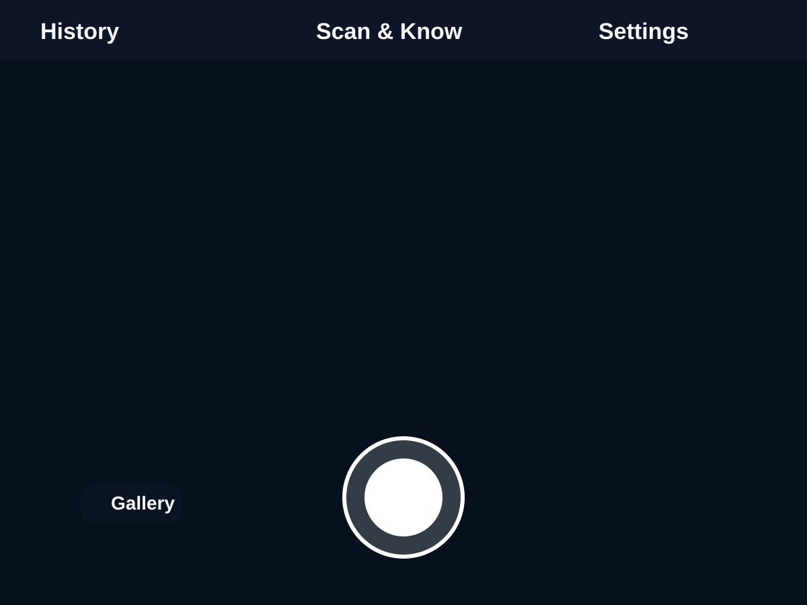
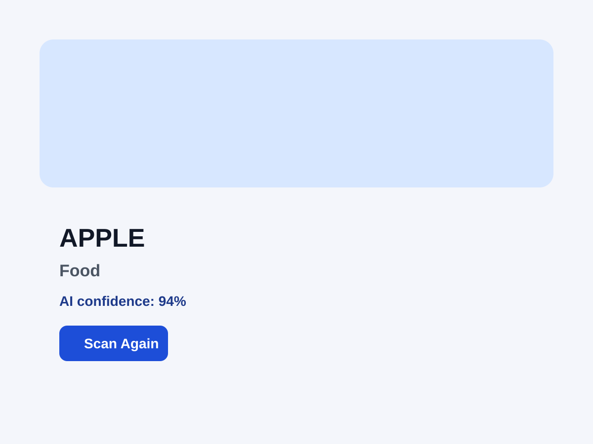
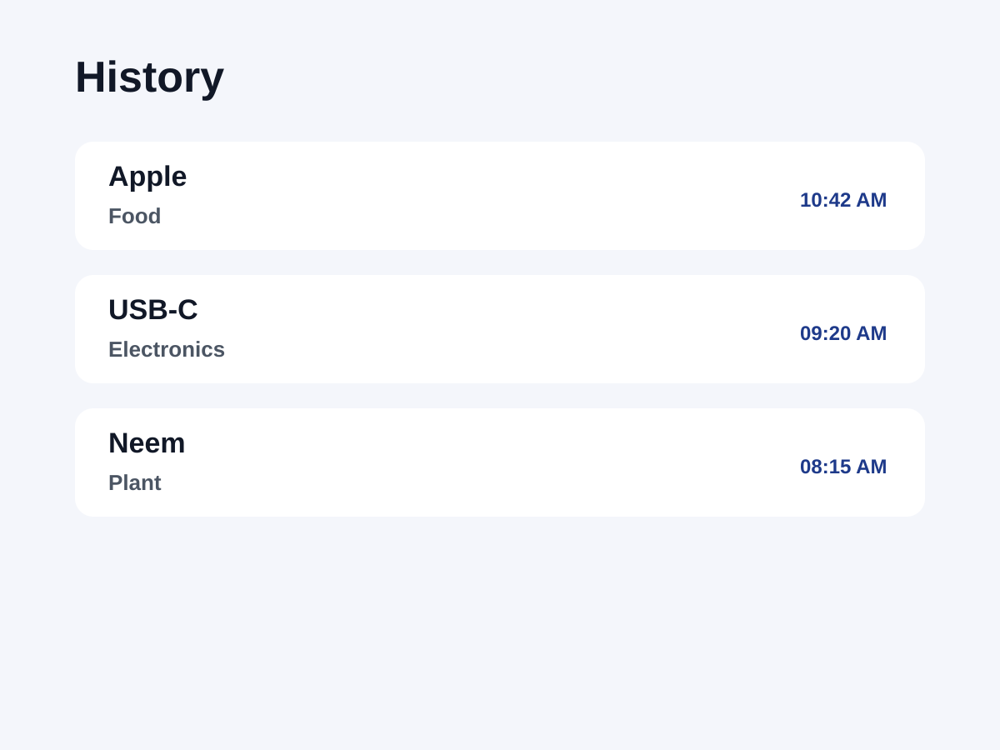

# Scan & Know

Scan & Know is a camera-first mobile app built with React Native + Expo that helps users scan any object, capture an image, and get a quick AI-powered explanation of what it is and how it is used.

This MVP keeps the core experience simple: open the app, point the camera, tap scan, and review the result.

## Features

- Camera-first workflow with permission handling
- One-tap scan action
- Gallery image import support
- AI vision analysis layer with environment-based configuration
- Result screen with key details, uses, facts, and warnings
- Local scan history using AsyncStorage
- Settings and privacy information
- Cross-platform Expo app structure for Android and iOS

## Screenshots

### Camera screen

### Result screen

### History screen

## Tech stack

- React Native
- Expo
- TypeScript
- Expo Router
- expo-camera
- expo-image-picker
- AsyncStorage
- Expo File System
- React Native Safe Area Context

## Project structure

- app/
- components/
- services/
- types/
- utils/
- constants/

## Getting started

1. Install dependencies

   npm install

2. Create your environment file

   cp .env.example .env

3. Add your AI credentials

   EXPO_PUBLIC_AI_API_KEY=YOUR_API_KEY
   EXPO_PUBLIC_AI_API_URL=YOUR_API_URL

4. Run the app

   npm start

5. Launch on a device or simulator

   - Android: press a
   - iOS: press i

## Security note

This project uses environment variables for the AI configuration and keeps the API layer separate from the UI so it can be moved behind a backend proxy later.

For production, do not expose private AI keys directly in a mobile app. The recommended approach is a small backend service that validates requests and proxies the AI call securely.

## Privacy

- No login required
- No social features
- No payment flow
- No unnecessary personal data collection
- Images are sent only to the configured AI service for analysis

## License

This project is provided as a starter app for experimentation and demo use.

## Notes

This is an MVP and designed to be simple, fast, and easy to extend. The AI integration is abstracted in the service layer so it can be swapped or upgraded later without major UI changes.
